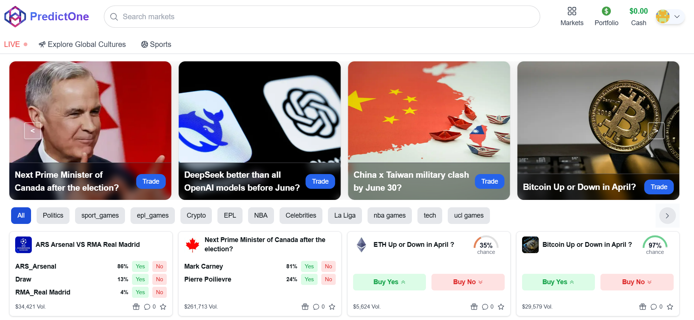
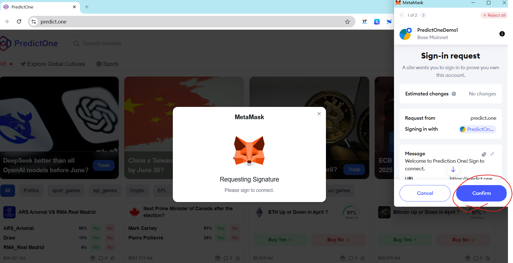
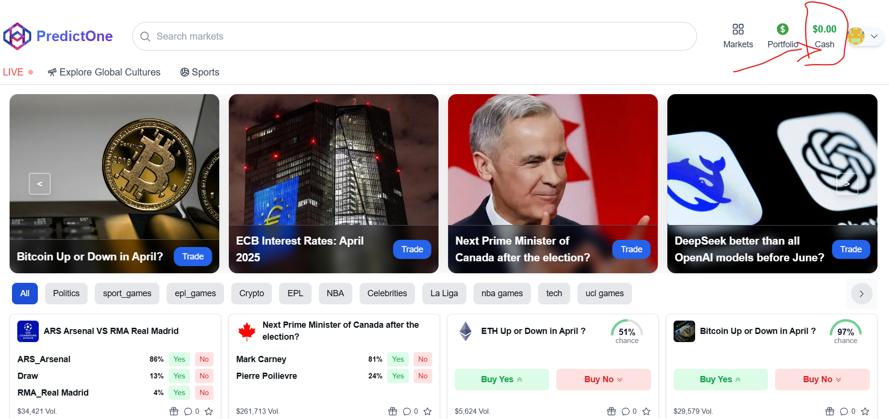
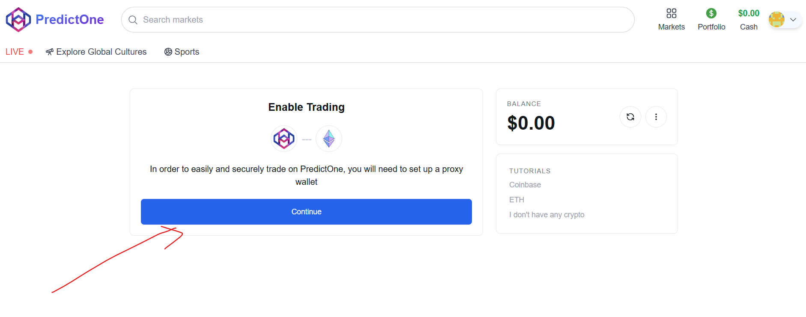
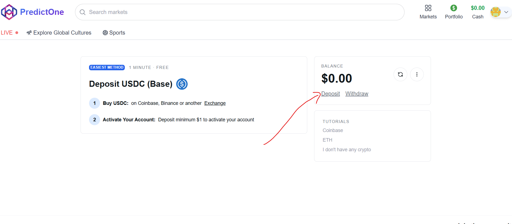
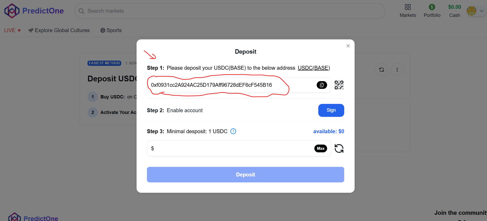
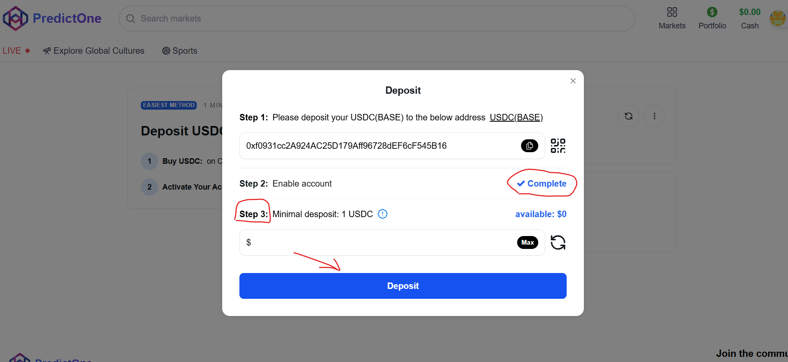
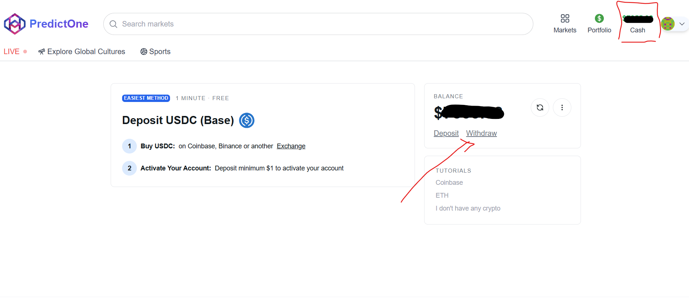
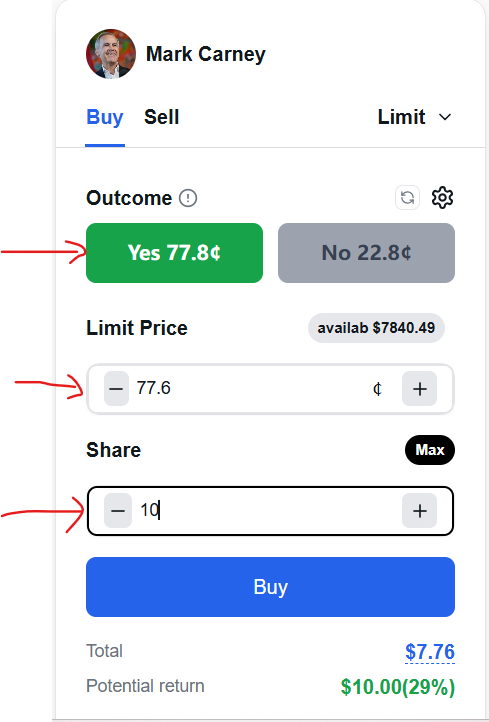

# What Is PredictOne

## **What is PredictOne?**

PredictOne is a large-scale prediction market designed to harness collective knowledge. It allows users to trade contracts based on the likelihood of future events happening. Studies suggest these markets can be highly accurate forecasters by aggregating news, data, and expert insights into real-time probabilities.

## **How it Works:**

1\. Event Markets: Choose from markets on various topics (e.g., "Will Policy X be enacted by Date Y?")

2\. Trade Shares: Buy "YES" or "NO" shares for the outcome. Share prices ($0.00 - $1.00 USDC) reflect the market's perceived probability.

3\. Peer-to-Peer: Trades happen directly between users who agree on the odds. Each matched YES/NO share pair is backed by $1.00 USDC.

4\. Resolution: When the event outcome is confirmed, shares for the correct outcome redeem for $1.00 USDC each. Incorrect shares become worthless.

5\. Trade Anytime: You can sell your shares to other users before the market resolves.

**Key Advantage:** PredictOne operates as a true market, not a sportsbook. You trade against other participants, meaning you can exit positions early, and your success won't lead to account restrictions.

## **Easy Start: Connect Wallet Only (No KYC/Signup Required)**

<figure><figcaption></figcaption></figure>

## **How To Deposit**

## **How To Withdraw**

Withdrawing your USDC from PredictOne is straightforward.

1\. Go to your PredictOne CASH page and click the Withdraw button.

2\. Enter the destination USDC address. Important: Make sure this address supports USDC on the Base network, as used by PredictOne.

3\. Enter the amount you want to withdraw.

4\. Click Withdraw. Your funds will typically be transferred quickly, subject to network confirmations.

## **How to Make Your First Trade on PredictOne**

### **Find Your Market:**

Start by browsing the 'Markets' page. Use the search, sort, and filter options to discover events you're interested in trading on.

### **Select an Outcome:**

Once you've chosen a market, look for the trading interface (often on the right). Decide if you want to buy 'YES' or 'NO' shares for the event outcome, and click your choice.

### **Place Your Order:**

Enter the amount of USDC you want to invest in the chosen shares.

### **Confirm & Buy:**

Click the 'Buy' button and approve the transaction using your crypto wallet. You'll get a confirmation message once the purchase is complete.

**Welcome to PredictOne! You've successfully placed your first trade.**

### **Spread the Word:**

Look for a way to share your trade details on social media. Letting others know what you're predicting is part of the fun!

## **Markets**

### **Market Odds**

PredictOne prices are determined entirely by users trading with each other (peer-to-peer), not by PredictOne.

Initialization: Markets start empty. Prices form when users place limit orders. A trade happens when a 'YES' buy order price + a 'NO' buy order price = $1.00 USDC. This creates the first shares (1 YES, 1 NO) backed by that $1.00 USDC. (Example: $0.75 YES order matches a $0.25 NO order).

User-Driven: PredictOne doesn't set odds. Prices reflect what users are currently willing to pay.

Live Prices: The displayed price is usually the midpoint of the highest bid and lowest ask. Prices constantly change based on supply and demand, like a stock market.

### **Market Resolution**

#### **PredictOne Market Resolution Process**

Markets on PredictOne are finalized ("resolved") through a secure resolution mechanism, often involving an optimistic oracle system.

#### **Overview**

Resolution occurs when the event's outcome is definitively known according to the market's specific rules (check the market details page).

Once resolved, holders of winning shares are paid $1.00 USDC per share, losing shares expire worthless, and trading stops.

The process usually begins with a user "proposing" the outcome. This requires staking a significant financial bond (using a specific asset like USDC on the correct network). This bond is at risk if the proposal is wrong.

A successful, unchallenged proposal typically earns the proposer their bond back plus a reward.

**Warning:** Proposing a resolution incorrectly or prematurely can result in the forfeiture of your entire bond. Understand the market rules and the resolution process thoroughly before proposing.

#### **How to Propose a Market Resolution:**

Navigate to the relevant market page on PredictOne.

Locate the "Resolution" or "Propose" section.

You may be directed to an external interface for the oracle system managing the resolution.

Confirm the required bond asset, amount, and network specified by PredictOne. Ensure you have sufficient funds in your connected wallet.

Select the outcome you believe is correct according to the rules.

Connect your wallet and submit the proposal transaction.

#### **Verification & Disputes:**

The submitted proposal enters a verification phase managed by the oracle system.

There is typically a challenge period after a proposal is made. If you disagree with a proposal, you may be able to dispute it during this window (often requiring your own bond). Consult PredictOne's documentation for details on disputes.

Unchallenged, correct proposals result in the proposer getting their bond back plus a reward. Disputed or incorrect proposals follow the oracle's defined dispute mechanism.

### **Market Rules**

Resolution strictly follows the rules published on the PredictOne market page.

Key details found in the rules include the resolution data source, the market deadline, and guidance for edge cases.

The market title is a summary; the rules are the final authority on how the market outcome is decided.

### **Disputing Outcomes**

## **How Disputes Work on PredictOne**

If you disagree with a proposed market resolution on PredictOne, you can challenge it.

## The Challenge Window:

After a resolution is proposed, there's a defined challenge period. Check PredictOne's rules for the exact duration.

If undisputed within this time, the proposal is usually accepted, and the proposer gets their bond back plus any reward.

### Starting a Dispute:

To challenge, you typically need to submit a dispute via the designated oracle interface during the challenge period.

This requires posting a challenge bond, often equal to the proposer's bond. Consult PredictOne's documentation for the exact requirements (asset, amount, network).

### The Resolution Process:

A valid dispute triggers a formal resolution process. This may involve:

A discussion or evidence-gathering phase where arguments can be presented (check PredictOne's guidelines for where this occurs).

A voting or arbitration mechanism where designated parties (e.g., token holders, specific arbiters) determine the correct outcome based on the market rules and evidence.

### **Potential Outcomes:**

\
The dispute resolution process will result in a final outcome, determining:

Which party (proposer or disputer) was correct.

How the bonds are distributed (typically, the losing party forfeits their bond, and the winning party receives theirs back plus potentially a portion of the forfeited bond).

Whether the proposal was invalid for other reasons (e.g., submitted too early).

How the market ultimately resolves if the outcome is deemed ambiguous.

Important: The specifics of the challenge period, bond requirements, dispute phases, voting mechanisms, and outcome consequences are defined by PredictOne and its chosen oracle system. Always refer to PredictOne's official documentation for accurate details before proposing or disputing a resolution.
